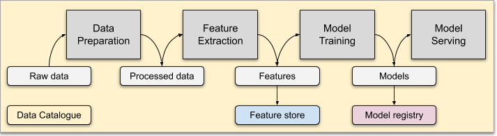

```
(\ 
\'\ 
 \'\     __________  		___  ___          _             
 / '|   ()_________)		|  \/  |         | |            
 \ '/    \ ~~~~~~~~ \		| .  . | __ _ ___| |_ _ __ ___  
   \       \ ~~~~~~   \		| |\/| |/ _  / __| __| __/  _  \ 
   ==).      \__________\	| |  | | (_| \__ \ |_| | | (_) |
  (__)       ()__________)	\_|  |_/\__,_|___/\__|_|  \___/ 
```
---
👷 Data and Feature Catalogue in Go

## Data What?


## Goals
Managing Metadata to achieve:
- Lineage - understanding data dependencies
- Quality - enrich data with dependability information
- Democratization - foster self-service culture

Modeling of the data transformation layer to foster:
- Reuse - of domain specific knowledge and pre-computed features in different use cases
- Enforcing - of established industry or domain-specific transformations and practices
- Interaction - between different roles through teams and projects

## Disclaimer

Mastro is still on development and largely untested. Please fork the repo and extend it at wish.

## TL-DR

Terminology:
* [Connector](doc/CONNECTORS.md) - component handling the connection to volumes and data bases
* [FeatureStore](doc/FEATURESTORE.md) - service to manage features (i.e., featureSets and featureStates);
* [Catalogue](doc/CATALOGUE.md) - service to manage data assets (i.e., static data definitions and their relationships);
* [Crawler](doc/CRAWLERS.md) - any agent able to list and walk a file system, filter and parse asset definitions (i.e. manifest files) and push them to the catalogue;

Help:
* [PlantUML Diagram of the repo](https://www.dumels.com/diagram/2e5f820a-1822-4852-8259-4811deefa789)
* [Configuration](doc/CONFIGURATION.md)